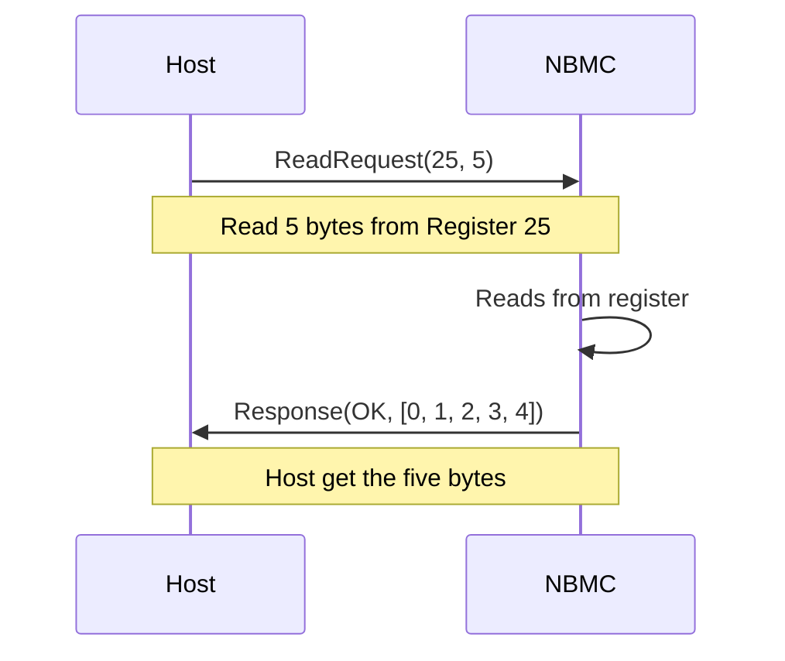
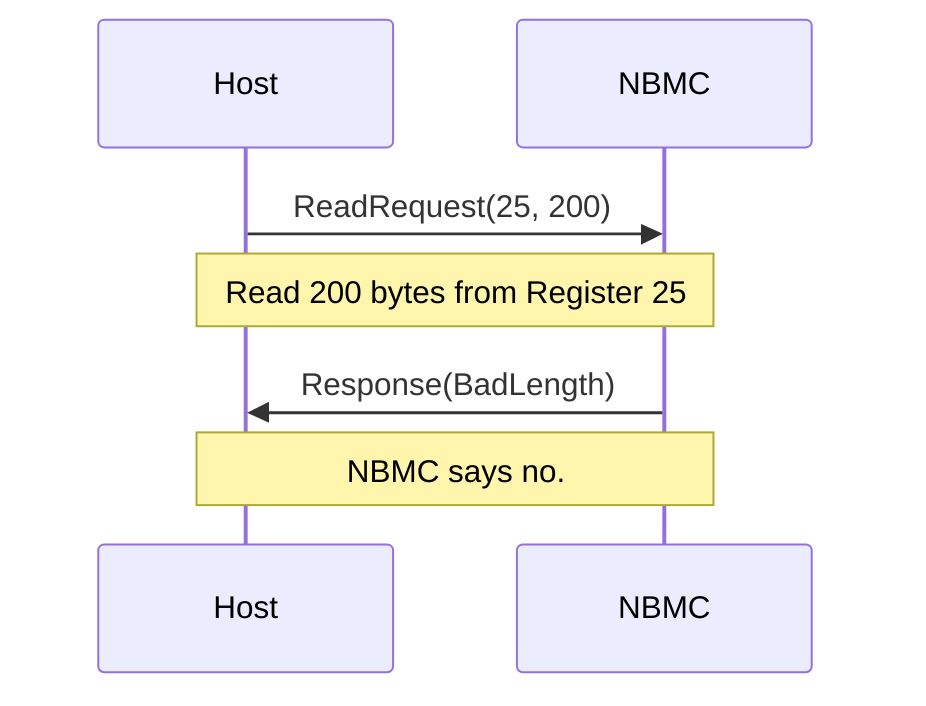
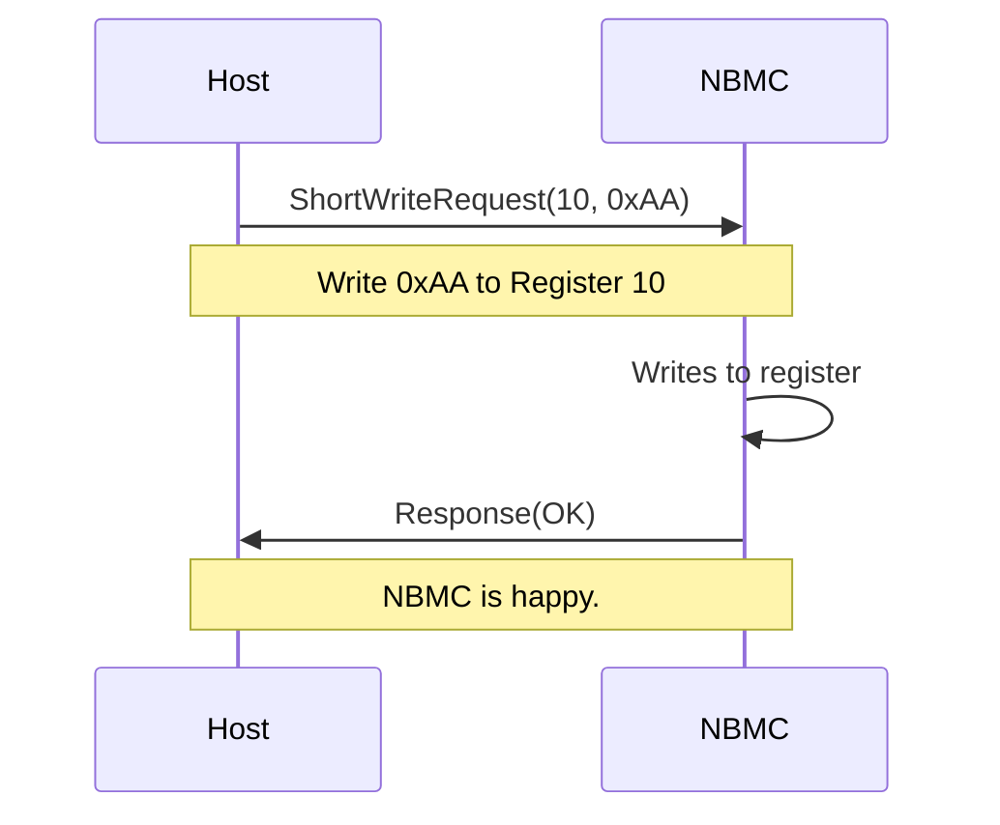
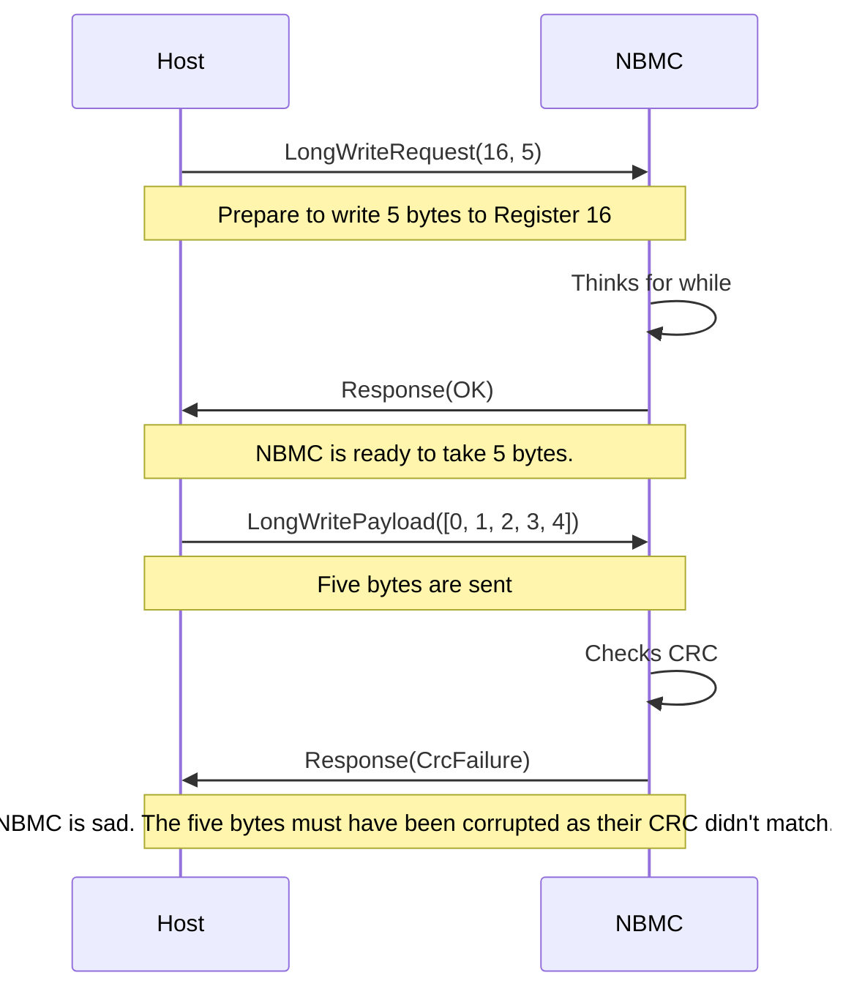

# Neotron-BMC

Firmware for the Neotron Board Management Controller (NBMC).

## Introduction

The NBMC is an always-on microcontroller used on Neotron systems. It has very low idle power consumption, allowing it to remain powered up at all times. This lets it listen to button events from the Power and Reset buttons, and control the system LEDs, main `~RESET` signal and turn the main 5V Power Rail on and off. This lets your Neotron system have smart 'ATX PC' style features like a soft power button, and it also ensures that all power rails come up before the system is taken out of reset.

The NBMC appears to the main Neotron system processor as an Expansion Device. As such it sits on the SPI bus as a peripheral device, with a dedicated Chip Select line and a dedicated IRQ line. It provides to the system:

* an extra I²C bus,
* a four-wire UART,
* two PS/2 ports (one for keyboard, one for a mouse),
* two analog inputs for monitoring for the 3.3V and 5.0V rails,
* two GPIO inputs for a power button and a reset button, and
* three GPIO outputs - nominally used for
    * the main DC/DC enable signal,
    * the power LED, and
    * a status LED.

## Hardware Interface

### Neotron Pico

The NBMC firmware is designed to run on an ST Micro STM32F0 (STM32F030K6T6) microcontroller, as fitted to a [Neotron Pico](https://github.com/neotron-compute/neotron-pico).

See the [board-specific README](./neotron-bmc-pico/README.md)

### Nucleo-F401

The NBMC firmware can also run on an ST Micro STM32F4 Nucleo board.

See the [board-specific README](./neotron-bmc-nucleo/README.md)

## SPI Communications Protocol

The SPI interface runs in SPI mode 0 (clock line idles low, data sampled on
rising edge) at 1 MHz (higher speeds TBD). It uses frames made up of 8-bit
words.

To communicate with the NBMC, the Host Processor must first take the Chip Select
line (`SPI1_nCS`) low, then send a Header. SPI is a full-duplex system, but in
this system only one side is actually transferring useful data at any time, so
whilst the Header is being sent the Host will receive Padding Bytes of `0xFF` in
return (which can be discarded).

A transfer is comprised of three stages.

1. `>` Request
2. `-` Turn-Around
3. `<` Reponse

A *Request* is a sequence of bytes sent from the *Host* to the *NBMC*.
*Turn-Around* is a period of time of interdeterminate length during which
the *Host* clocks out dummy bytes and the *NBMC* responds with `0xFF` bytes,
which indicate that it has not yet formulated the *Response*. This period ends,
with the transmission of the *Response* from the *NBMC* to the *Host*. 

There are different kinds of *Request* that can be made. Each has a corresponding *Response*.

| Request Type       | Contains                        | Length       | Response Type |
| ------------------ | ------------------------------- | ------------ | ------------- |
| Read               | Type, Register#, Length, CRC    | 4            | Read          |
| Short Write        | Type, Register#, Data Byte, CRC | 4            | Short         |
| Long Write Start   | Type, Register#, Length, CRC    | 4            | Short         |
| Long Write Payload | `Length` Bytes, CRC             | `Length` + 1 | Short         |

| Response Type | Contains                    | Length       |
| ------------- | --------------------------- | ------------ |
| Short         | Result, CRC                 | 2            |
| Read          | Result, `Length` Bytes, CRC | `Length` + 2 |

To allow the *NBMC* to be efficient at receiving data over SPI, it is important
that the first *Request* received after the `nCS` pin goes active-low is of a
fixed length. Here, all of the initial *Requests* have a fixed size of four
bytes. A *Long Write Start Request* tells the *NBMC* to expect a *Request* of a
different length to follow immediately after, which allows the *NBMC* to
re-configure the DMA to expect the longer length *Request*. The *Long Write
Payload* MUST only be sent following a *Long Write Start*, and without resetting
the `nCS` signal in-between.

### Request Types

* `0xC0`: Read
* `0xC1`: Read (alternate)
* `0xC2`: Short Write 
* `0xC3`: Long Write

### Response Results

* `0xA0`: OK
* `0xA1`: CRC Failure
* `0xA2`: Bad Request Type
* `0xA3`: Bad Register#
* `0xA4`: Bad Length

### Read Request / Response Sequence

A *Read Request* consists of four 8-bit values:

* A *Type* byte of either `0xC0` or `0xC1` marking this as a *Read Request*.
* A *Register#*, indicating which register within the *NBMC* the *Host* wishes to read.
* A Length, indicating how many bytes are to be read from the given *Register#*.
* A *CRC*, which is the CRC-8 of the proceeding three bytes.

The *Type* byte should alternate between `0xC0` and `0xC1` so that the *NBMC*
can tell if the *Read Request* is a repeat of the previous request. This may
occur, for example, if the *Read Response* fails its CRC check on arrival at the
*Host*. Because a *Read Request* can have side-effects (like removing bytes from
a FIFO), a repeated *Read Request* should return preceisely the same values as
before, rather than, say, fetching more new bytes from the FIFO. This allows the
FIFO to be read in a lossless fashion, even when there is occasional corruption
on the SPI bus.

A *Read Response* consists of a variable number of 8-bit values:

* A *Response Result* code indicating whether the read operation was successful
  or not.
* A *Payload* consisting of the number of bytes requested in the *Read
  Operation* (only present if the *Result* byte indicates Success)
* A *CRC*, which is the CRC-8 of all the proceeding bytes.

#### Example of Success

#### Example of Failure

### Short Write Request / Response Sequence

A *Short Write Request* consists of four 8-bit values:

* A *Type* byte of `0xC2` marking this as a *Short Write Request*.
* A *Register#*, indicating which register within the *NBMC* the *Host* wishes to write to.
* A *Data Byte*, which is to be written to the given *Register#*.
* A *CRC*, which is the CRC-8 of the proceeding three bytes.

A *Short Response* is sent in returning, containing two bytes:

* A [*Response Result*](#response-result-codes) code indicating whether the read
  operation was successful or not.
* A *CRC*, which is the CRC-8 of all the sole proceeding byte.

You could equally consider a *Short Response* as a single 16-bit big-endian
value, being one of `0xA069`, `0xA16E`, `0xA267`, `0xA360` or `0xA475`.

#### Example of Success

### Long Write Request / Response Sequence

A *Long Write Request* consists of four 8-bit values:

* A *Type* byte of `0xC2` marking this as a *Short Write Request*.
* A *Register#*, indicating which register within the *NBMC* the *Host* wishes to write to.
* A *Length*, which is the number of payload bytes to follow in the subsequent *Long Write Payload*.
* A *CRC*, which is the CRC-8 of the proceeding three bytes.

A *Short Response* is sent, as per [Short Write
Request](#short-write-request--response-sequence)

If a *Short Response* is received containing a *Response Result* of **OK**
(`0xA0`), the *NBMC* is ready to receive a *Long Write Payload*. If any other
*Response Result* is received, the *Long Write Payload* must not be send and
`nCS` must be raised to indicate the end of the transaction.

A *Long Write Payload* consists of a variable number of 8-bit values:

* A *Payload* consisting of the number of bytes requested in the *Long Write Request*
* A *CRC*, which is the CRC-8 of all the proceeding bytes.

This message must always contain exactly the number of bytes stated in the
*Length* field of the *Long Write Request*, plus one additional CRC byte.

A second *Short Response* is then sent, as per [Short Write
Request](#short-write-request--response-sequence). The `nCS` signal must be
raised at this point to restart the write sequence, regardless of the specific
*Response Result* sent.

#### Example of Success

### Cancelling

Any *Request* can be cancelled by the *Host* lifting `nCS` high before the
*Request* has finished sending. This allows the *NBMC* to accomodate unexpected
*Host* reboots (as during a reboot it is expected that the `nCS` line will be
raised).

## System Registers

| Address | Name                                  | Type  | Contains                                                 | Length   |
| ------- | ------------------------------------- | ----- | -------------------------------------------------------- | -------- |
| 0x00    | Firmware Version                      | RO    | The NBMC firmware version, as a null-padded UTF-8 string | 64       |
| 0x01    | Interrupt Status                      | R/W1C | Which interrupts are currently active, as a bitmask.     | 2        |
| 0x02    | Interrupt Control                     | R/W   | Which interrupts are currently enabled, as a bitmask.    | 2        |
| 0x03    | Button Status                         | RO    | The current state of the buttons                         | 1        |
| 0x04    | System Temperature                    | RO    | Temperature in °C, as an `i8`                            | 1        |
| 0x05    | System Voltage (Standby 3.3V rail)    | RO    | Voltage in Volts/32, as a `u8`                           | 1        |
| 0x06    | System Voltage (Main 3.3V rail)       | RO    | Voltage in Volts/32, as a `u8`                           | 1        |
| 0x07    | System Voltage (5.0V rail)            | RO    | Voltage in Volts/32, as a `u8`                           | 1        |
| 0x08    | Power Control                         | RW    | Enable/disable the power supply                          | 1        |
| 0x10    | UART Receive/Transmit Buffer          | FIFO  | Data received/to be sent over the UART                   | up to 64 |
| 0x11    | UART FIFO Control                     | R/W   | Settings for the UART FIFO                               | 1        |
| 0x12    | UART Control                          | R/W   | Settings for the UART                                    | 1        |
| 0x13    | UART Status                           | R/W1C | The current state of the UART                            | 1        |
| 0x14    | UART Baud Rate                        | R/W   | The UART baud rate in bps, as a `u32le`                  | 4        |
| 0x20    | PS/2 Keyboard Receive/Transmit Buffer | FIFO  | Data received/to be sent over the PS/2 keyboard port     | up to 16 |
| 0x21    | PS/2 Keyboard Control                 | R/W   | Settings for the PS/2 Keyboard port                      | 1        |
| 0x22    | PS/2 Keyboard Status                  | R/W1C | Current state of the PS/2 Keyboard port                  | 1        |
| 0x30    | PS/2 Mouse Receive/Transmit Buffer    | FIFO  | Data received/to be sent over the PS/2 Mouse port        | up to 16 |
| 0x31    | PS/2 Mouse Control                    | R/W   | Settings for the PS/2 Mouse port                         | 1        |
| 0x32    | PS/2 Mouse Status                     | R/W1C | Current state of the PS/2 Mouse port                     | 1        |
| 0x40    | I²C Receive/Transmit Buffer           | FIFO  | Data received/to be sent over the I²C Bus                | up to 16 |
| 0x41    | I²C FIFO Control                      | R/W   | Settings for the I²C FIFO                                | 1        |
| 0x42    | I²C Control                           | R/W   | Settings for the I²C Bus                                 | 1        |
| 0x43    | I²C Status                            | R/W1C | Current state of the I²C Bus                             | 1        |
| 0x44    | I²C Baud Rate                         | R/W   | The I²C clock rate in Hz, as a `u32le`                   | 4        |

The register types are:

* `RO` - read only register, where writes will return an error
* `R/W` - read/write register
* `R/W1C` - reads as usual, but when writing a 1 bit clears that bit position and a 0 bit is ignored
* `FIFO` - a first-in, first-out buffer

### Address 0x00 - Firmware Version

This read-only register returns the firmware version of the NBMC, as a UTF-8 string. The register length is always 64 bytes, and the string is null-padded. We also guarantee that the firmware version will always be less than or equal to 63 bytes, so you can also treat this string as null-terminated.

An official release will have a version string of the form `tags/v1.2.3`. An unofficial release might be `heads/develop-dirty`. It is not recommended that you rely on these formats or attempt to parse the version string. It is however useful if you can quote this string when reporting issues with the firmware.

### Address 0x01 - Interrupt Status

This eight bit register indicates which Interrupts are currently 'active'. An Interrupt will remain 'active' until a word is written to this register with a 1 bit in the relevant position.

| Bit | Interrupt                  |
| --- | -------------------------- |
| 7   | Voltage Alarm              |
| 6   | Button State Change        |
| 5   | UART TX Empty              |
| 4   | UART RX Not Empty          |
| 3   | I²C TX Empty               |
| 2   | I²C RX Not Empty           |
| 1   | PS/2 Mouse RX Not Empty    |
| 0   | PS/2 Keyboard RX Not Empty |

### Address 0x02 - Interrupt Control

This eight bit register indicates which Interrupts are currently 'enabled'. The IRQ_nHOST signal is a level interrupt and it will be active (LOW) whenever the value in the Interrupt Control register ANDed with the Interrupt Status register is non-zero.

The bits have the same ordering as the Interrupt Status register.

### Address 0x03 - Button Status

This eight-bit register indicates the state of the power button.

Note that if the power button is held down for three seconds, the system will power-off instantly, regardless of what the host does.

Note also that is it not possible to sample the reset button - pressing the reset button will instantly assert the system reset line, rebooting the Host.

| Bits | Meaning                               |
| ---- | ------------------------------------- |
| 7-1  | Reserved for future use               |
| 0    | Power Button: 0 = normal, 1 = pressed |

### Address 0x04 - System Temperature

This eight-bit register provides the current system temperature in °C, as measured on the STM32's internal temperature sensor. It is updated around once a second.

### Address 0x05 - System Voltage (Standby 3.3V rail)

This eight-bit register provides the current 3.3V rail voltage in units of 1/32 of a Volt. It is updated around once a second. A value of 105 (3.28V) to 106 (3.31V) is nominal. An interrupt is raised when the value exceeds 3.63V (116) or is lower than 2.97V (95).

### Address 0x06 - System Voltage (Main 3.3V rail)

This eight-bit register provides the current 3.3V rail voltage in units of 1/32 of a Volt. It is updated around once a second. A value of 105 (3.28V) to 106 (3.31V) is nominal. An interrupt is raised when the value exceeds 3.63V (116) or is lower than 2.97V (95).

### Address 0x07 - System Voltage (5.0V rail)

This eight-bit register provides the current 3.3V rail voltage in units of 1/32 of a Volt. It is updated around once a second. A value of 160 (5.00V) is nominal. An interrupt is raised when the value exceeds 5.5V (176) or is lower than 4.5V (144).

### Address 0x08 - Power Control

This eight-bit register controls the main DC/DC power supply unit. The Host should disable the DC/DC supply (by writing zero here) if it wishes to power down.

| Bits | Meaning                        |
| ---- | ------------------------------ |
| 7-1  | Reserved for future use        |
| 0    | DC/DC control: 0 = off, 1 = on |

### Address 0x10 - UART Receive/Transmit Buffer

TODO

### Address 0x11 - UART FIFO Control

TODO

### Address 0x12 - UART Control

TODO

### Address 0x13 - UART Status

TODO

### Address 0x14 - UART Baud Rate

TODO

### Address 0x20 - PS/2 Keyboard Receive/Transmit Buffer

TODO

### Address 0x21 - PS/2 Keyboard Control

TODO

### Address 0x22 - PS/2 Keyboard Status

TODO

### Address 0x30 - PS/2 Mouse Receive/Transmit Buffer

TODO

### Address 0x31 - PS/2 Mouse Control

TODO

### Address 0x32 - PS/2 Mouse Status

TODO

### Address 0x40 - I²C Receive/Transmit Buffer

TODO

### Address 0x41 - I²C FIFO Control

TODO

### Address 0x42 - I²C Control

TODO

### Address 0x43 - I²C Status

TODO

### Address 0x44 - I²C Baud Rate

TODO

## Build Requirements

Build requirements are available for [Neotron-BMC-pico](neotron-bmc-pico/README.md) and [Neotron-BMC-nucleo](neotron-bmc-nucleo/README.md). 

## Licence

This code is licenced under the GNU Public Licence version 3. See:

* [The LICENSE file](./LICENSE)
* [The GPL Website](http://www.gnu.org/licenses/gpl-3.0.html)

Our intent behind picking this licence is that you must ensure anyone who receives a programmed Neotron BMC processor, also receives:

* A note stating that the firmware is licenced under the GPL v3, and
* Access to Complete and Corresponding Source Code (e.g. in the form of the URL of this repository, or the source repository the firmware was built from if not this one).

For the avoidance of doubt, it is not our intention to:

* prevent you from selling PCBs containing a programmed Neotron BMC processor, or
* prevent you from making changes to the Neotron BMC source code.

It is however our intention to ensure that anyone who sells or distributes this firmware (or products that contain it):

* provides proper attribution, and
* gives the customers/recipients access to the source code, including any changes that were made.

Note that this firmware image incorporates a number of third-party modules. You should review the output of `cargo tree` and ensure that any licence terms for those modules are upheld. You should also be aware that this application was based on the Knurling Template at https://github.com/knurling-rs/app-template.
