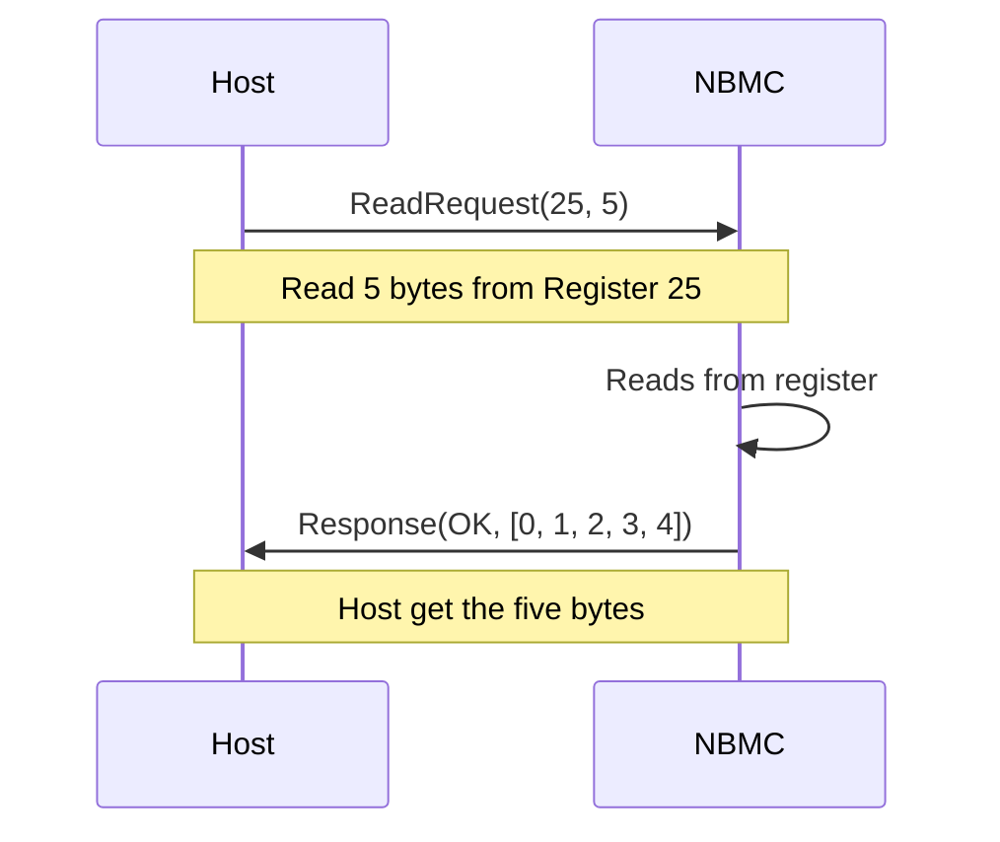
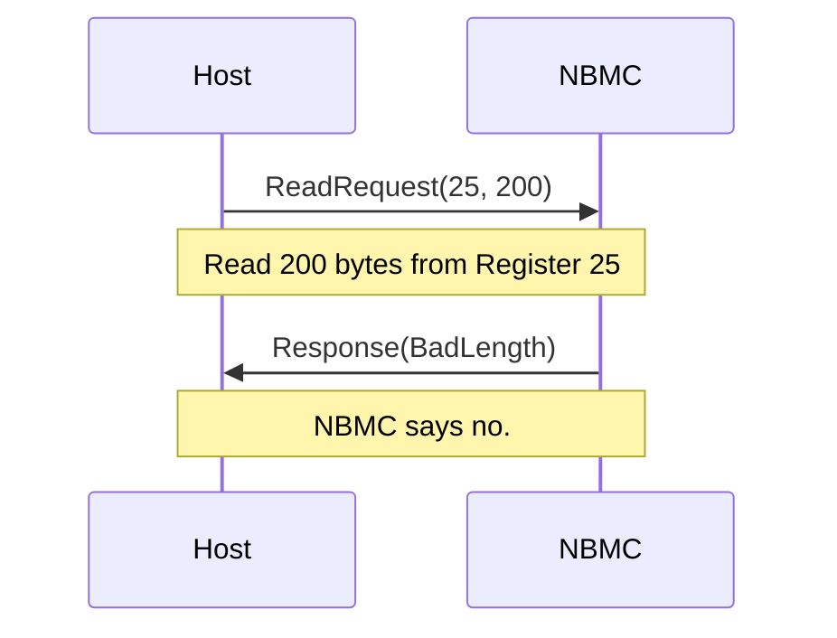
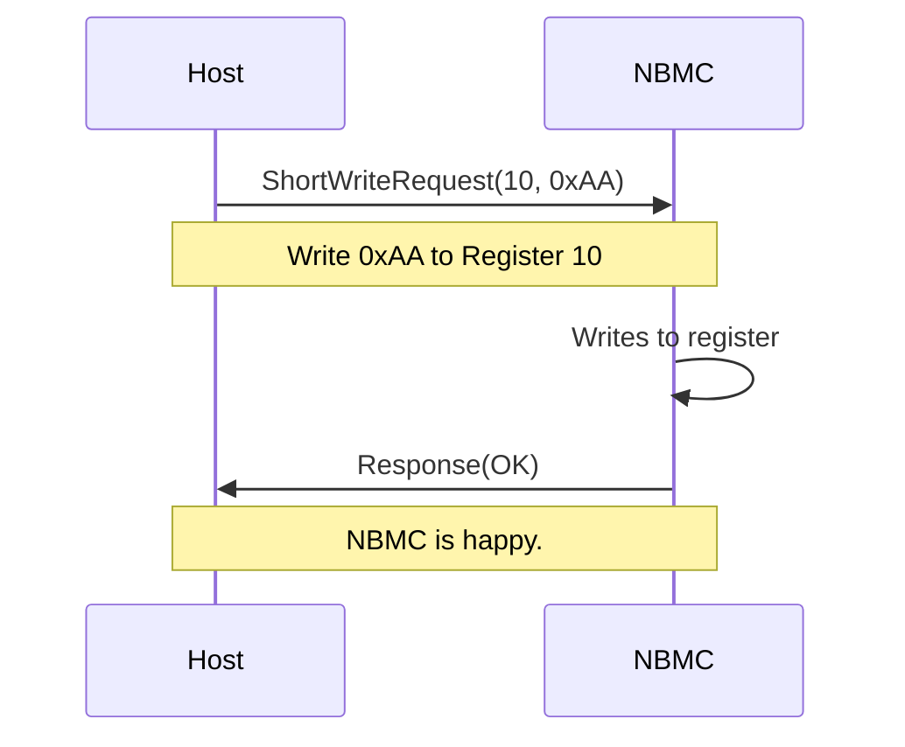
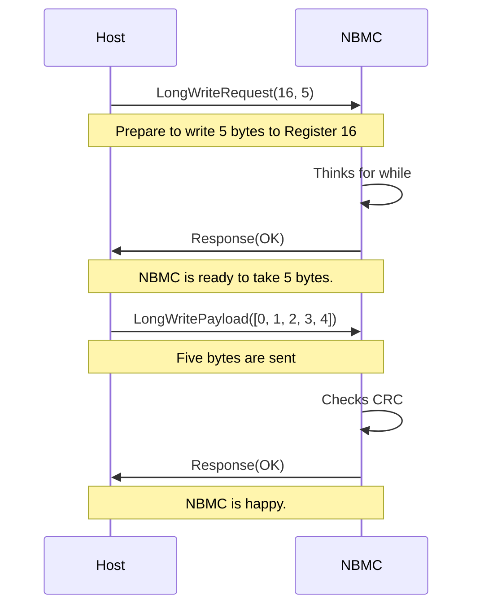
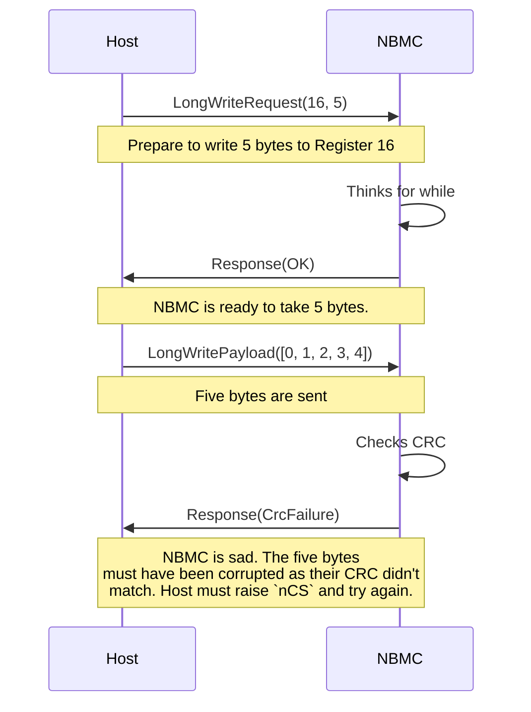

# Neotron-BMC-Protocol

Protocol code for communication with the Neotron Board Management Controller (NBMC).

## Introduction

The NBMC is an always-on microcontroller used on Neotron systems. It has very
low idle power consumption, allowing it to remain powered up at all times. This
lets it listen to button events from the Power and Reset buttons, and control
the system LEDs, main `~RESET` signal and turn the main 5V Power Rail on and
off. This lets your Neotron system have smart 'ATX PC' style features like a
soft power button, and it also ensures that all power rails come up before the
system is taken out of reset.

The NBMC sits on the SPI bus, receives *Requests* and sends *Responses* in
reply. It can also raise an IRQ line.

This crate describes the protocol run over the SPI bus and provides some basic
helper code for implementing the protocol in Rust.

## SPI Communications Protocol

To communicate with the NBMC, the Host Processor must first take the Chip Select
line (`nCS`) low, then send a Header. SPI is a full-duplex system, but in
this system only one side is actually transferring useful data at any time, so
whilst the Header is being sent the Host will receive Padding Bytes of `0xFF` in
return (which can be discarded).

A transfer is comprised of three stages.

1. `>` Request
2. `-` Turn-Around
3. `<` Reponse

A *Request* is a sequence of bytes sent from the *Host* to the *NBMC*.
*Turn-Around* is a period of time of interdeterminate length during which
the *Host* clocks out dummy bytes and the *NBMC* responds with `0xFF` bytes,
which indicate that it has not yet formulated the *Response*. This period ends,
with the transmission of the *Response* from the *NBMC* to the *Host*. 

There are different kinds of *Request* that can be made. Each has a
corresponding *Response*.

| Request Type       | Contains                        | Length       | Response Type |
| ------------------ | ------------------------------- | ------------ | ------------- |
| Read               | Type, Register#, Length, CRC    | 4            | Read          |
| Short Write        | Type, Register#, Data Byte, CRC | 4            | Short         |
| Long Write Start   | Type, Register#, Length, CRC    | 4            | Short         |
| Long Write Payload | `Length` Bytes, CRC             | `Length` + 1 | Short         |

| Response Type | Contains                    | Length       |
| ------------- | --------------------------- | ------------ |
| Short         | Result, CRC                 | 2            |
| Read          | Result, `Length` Bytes, CRC | `Length` + 2 |

To allow the *NBMC* to be efficient at receiving data over SPI, it is important
that the first *Request* received after the `nCS` pin goes active-low is of a
fixed length. Here, all of the initial *Requests* have a fixed size of four
bytes. A *Long Write Start Request* tells the *NBMC* to expect a *Request* of a
different length to follow immediately after, which allows the *NBMC* to
re-configure the DMA to expect the longer length *Request*. The *Long Write
Payload* MUST only be sent following a *Long Write Start*, and without resetting
the `nCS` signal in-between.

### Request Types

* `0xC0`: Read
* `0xC1`: Read (alternate)
* `0xC2`: Short Write 
* `0xC3`: Long Write

### Response Results

* `0xA0`: OK
* `0xA1`: CRC Failure
* `0xA2`: Bad Request Type
* `0xA3`: Bad Register#
* `0xA4`: Bad Length

### Read Request / Response Sequence

A *Read Request* consists of four 8-bit values:

* A *Type* byte of either `0xC0` or `0xC1` marking this as a *Read Request*.
* A *Register#*, indicating which register within the *NBMC* the *Host* wishes
  to read.
* A Length, indicating how many bytes are to be read from the given *Register#*.
* A *CRC*, which is the CRC-8 of the proceeding three bytes.

The *Type* byte should alternate between `0xC0` and `0xC1` so that the *NBMC*
can tell if the *Read Request* is a repeat of the previous request. This may
occur, for example, if the *Read Response* fails its CRC check on arrival at the
*Host*. Because a *Read Request* can have side-effects (like removing bytes from
a FIFO), a repeated *Read Request* should return preceisely the same values as
before, rather than, say, fetching more new bytes from the FIFO. This allows the
FIFO to be read in a lossless fashion, even when there is occasional corruption
on the SPI bus.

A *Read Response* consists of a variable number of 8-bit values:

* A *Response Result* code indicating whether the read operation was successful
  or not.
* A *Payload* consisting of the number of bytes requested in the *Read
  Operation* (only present if the *Result* byte indicates Success)
* A *CRC*, which is the CRC-8 of all the proceeding bytes.

#### Example of Success

#### Example of Failure

### Short Write Request / Response Sequence

A *Short Write Request* consists of four 8-bit values:

* A *Type* byte of `0xC2` or `0xC3` marking this as a *Short Write Request*.
* A *Register#*, indicating which register within the *NBMC* the *Host* wishes to write to.
* A *Data Byte*, which is to be written to the given *Register#*.
* A *CRC*, which is the CRC-8 of the proceeding three bytes.

A *Short Response* is sent in returning, containing two bytes:

* A [*Response Result*](#response-result-codes) code indicating whether the read
  operation was successful or not.
* A *CRC*, which is the CRC-8 of all the sole proceeding byte.

You could equally consider a *Short Response* as a single 16-bit big-endian
value, being one of `0xA069`, `0xA16E`, `0xA267`, `0xA360` or `0xA475`.

#### Example of Success

### Long Write Request / Response Sequence

A *Long Write Request* consists of four 8-bit values:

* A *Type* byte of `0xC4` or `0xC5` marking this as a *Long Write Request*.
* A *Register#*, indicating which register within the *NBMC* the *Host* wishes to write to.
* A *Length*, which is the number of payload bytes to follow in the subsequent *Long Write Payload*.
* A *CRC*, which is the CRC-8 of the proceeding three bytes.

A *Short Response* is sent, as per [Short Write
Request](#short-write-request--response-sequence)

If a *Short Response* is received containing a *Response Result* of **OK**
(`0xA0`), the *NBMC* is ready to receive a *Long Write Payload*. If any other
*Response Result* is received, the *Long Write Payload* must not be sent and
`nCS` must be raised to indicate the end of the transaction.

A *Long Write Payload* consists of a variable number of 8-bit values:

* A *Payload* consisting of the number of bytes requested in the *Long Write Request*
* A *CRC*, which is the CRC-8 of all the proceeding bytes.

This message must always contain exactly the number of bytes stated in the
*Length* field of the *Long Write Request*, plus one additional CRC byte.

A second *Short Response* is then sent, as per [Short Write
Request](#short-write-request--response-sequence). The `nCS` signal must be
raised at this point to restart the write sequence, regardless of the specific
*Response Result* sent.

#### Example of Success

#### Example of Failure

### Cancelling

Any *Request* can be cancelled by the *Host* lifting `nCS` high before the
*Request* has finished sending. This allows the *NBMC* to accomodate unexpected
*Host* reboots (as during a reboot it is expected that the `nCS` line will be
raised).

## Licence

This code is licenced under the Blue Oak Model License 1.0.0. See:

* [The LICENSE file](./LICENSE)
* [The Blue Oak Licence Website](https://blueoakcouncil.org/license/1.0.0)

Our intent behind picking this licence is to allow this code to be freely
reused, both in open-source and commercially licensed products.
